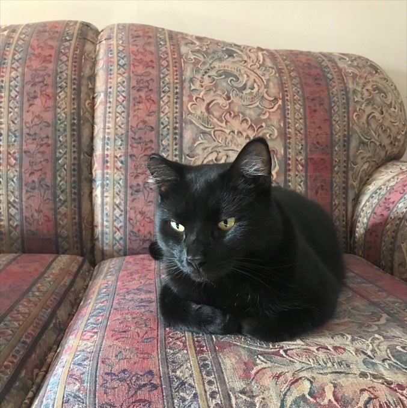
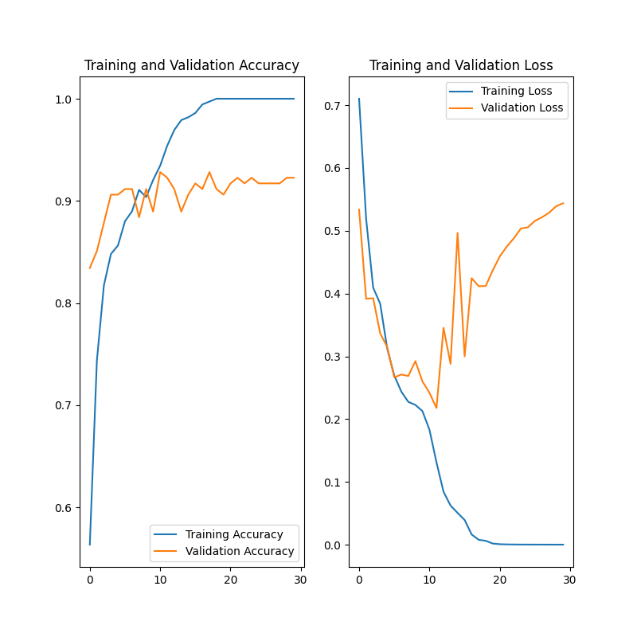

# bubbles_detector
Using a neural network to determine if my cat, Bubbles, is in a photo.

## I take a lot of photos of my cat, Bubbles. 

#### I decided to try creating a algorithm to detect if Bubbles is in a photo using a convoluted neural network. I used my learnings from the Udacity course "Intro to Tensorflow for Deep Learning" for this algorithm.

# Data

#### I used a total of 413 photos of Bubbles along with 485 photos that do not contain Bubbles. I organized these photos into subfolders, where 80% of the photos were used for training, and 20% were used for validation. I was then able to use the os library to drill into these folders and easily grab all the photos.

# Model

#### The model consists of five layers. The first four layers are convulation blocks with a max pool layer in each. The final layer iss fully connected, with a relu activation function.

# Attempt 1

#### My firsts attempt at training my algorithm gave the below output:

#### This clearly shows overfitting, where both the validation accuracy and training accuraty plateau very quickly, and the validation loss increases with number of epochs. 

#### One cause of the overfitting could be a lack of data, however, it don't have any more photos of Bubbles so instead I'll have to try some different techniques to correct the overfitting.

